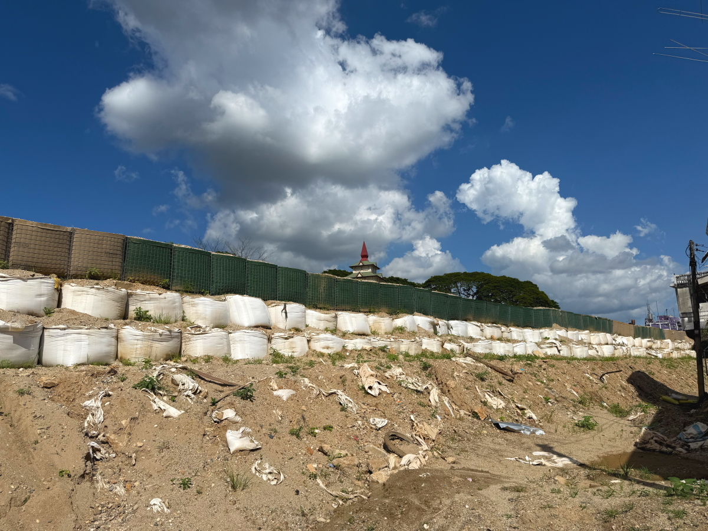
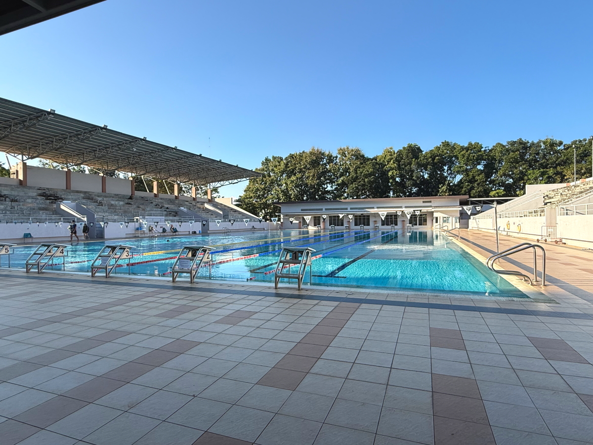

# 20251020_maechan

<html lang="ja" data-loaded="false" data-scrolled="false" data-spmenu="closed">
<head>

<meta charset="UTF-8">
<meta http-equiv="Content-Type" content="text/html; charset=UTF-8">
<meta http-equiv="X-UA-Compatible" content="IE=EmulateIE10" />
<meta http-equiv="X-UA-Compatible" content="IE=edge">

<meta name="viewport" content="width=device-width, initial-scale=1.0">

<!--ここから上はお決まりの定型文です-->

<!--ここからが表現の書式などを決めるcssという部分-->

<link href="https://cdnjs.cloudflare.com/ajax/libs/lightbox2/2.7.1/css/lightbox.css" rel="stylesheet">

</head>

<body>
    
<!--
    
<a href="https://torokoid.github.io/20250927_maechan/">Happy Birthday</a>><a href="https://torokoid.github.io/20250927__maechan/">Polis's Home></a>Polis's Home_2

-->

モバイル端末をお使いの場合は、画面を横向きにすると
背景画像の横方向がご覧頂けます。

<!--ここ上は、ほぼそのまま使います！-->

<!--QRコードの挿入例-->

 QR for Access

<marquee direction="left" scrollamount="20" width="30%">(^_^)/~Hada</marquee>

<!--流れ文字の挿入例-->
<h1><marquee behavior="left">!!! 2025/10/18-19 、国境の街に向かう国道から、星空まで !!!</marquee></h1>

                          

<!--ここから下が、本体部分-->
    

<h2>18,Oct,2025 国道を北上して、国境の街メーサイに向かいます</h2>

    
<h2>お坊さんを乗せたトラック</h2>

    
<h2>西側は国境に続く、山岳地帯</h2>

    
<h2>タイで稼いで週末を本国で過ごすために移動するミャンマーの女性達</h2>

    
<h2>メーサイの看板が見え始めます</h2>

    
<h2>大きな交差点に必ずいる、飲み物やお花売りの人たち</h2>

    
<h2>街灯の飾り付けが変わって、メーサイの街に入ったのがわかります</h2>

    
<h2>町役場でいろいろ聞きます</h2>

    
<h2>同じ敷地の奥側が警察署</h2>

    
<h2>タイ北端の国境に向かいます</h2>

    
<h2>正面の白い門がミャンマーとの国境の門</h2>

    
<h2>車を停めた駐車場の神棚がメーチャンとは違う形式</h2>

    
<h2>国境の川が氾濫したので、堤防が積み上げられてました</h2>

    
<h2>国境の街は物流拠点、かなり大きな市場です</h2>

    
<h2>本物の銃も売ってます</h2>

    
<h2>市場内の狭い通路でもバイクで移動</h2>

    
<h2>どんなブランドでも150バーツ</h2>

    
<h2>国境の門を裏側（ミャンマー側）から見てます</h2>

    
<h2>ギターもありました</h2>

    
<h2>国境の川の向こうのお寺はミャンマーのお寺</h2>

    
<h2>駐車場は日陰に入れてもらえて、時間無制限で50バーツ</h2>

    
<h2>市場での買い物も済ませて、国道を南下</h2>

    
<h2>街の学校の塀が個性的</h2>

    
<h2>郊外エリアの携帯基地局の鉄塔が、かなり高め、人口密度がまばらでサービスエリアを広げるため？</h2>

    
<h2>移動したのはこんな場所</h2>

    
<h2>メーチャンに戻っていつもの市場</h2>

    
<h2>ちょっとした焼き物をいただきます</h2>

    
<h2>横のコンビニのCD機</h2>

<h2>CD機の通信アンテナがアマチュア無線用のものの流用でした</h2>

    
<h2>庭のお花は今日も満開</h2>

    
<h2>夜のご飯のおかずは、蜂の子</h2>

    
<h2>デザートはお豆</h2>

    
<h2>夜の星空はスマホで撮れるレベル</h2>

    
<h2>19,Oct,2025 朝から雲ひとつない青空が広がりました</h2>

    
<h2>この辺りではHondaもFIATも同じ扱い？</h2>

<h2>街のお祭りの日なので、お寺に向かいます 例によってトラック荷台からの撮影</h2>

<iframe width="560" height="315" src="https://www.youtube.com/embed/sygaq_fpJ7g?si=saWuMGJuITZXuJWk" title="YouTube video player" frameborder="0" allow="accelerometer; autoplay; clipboard-write; encrypted-media; gyroscope; picture-in-picture; web-share" referrerpolicy="strict-origin-when-cross-origin" allowfullscreen></iframe>
    

<h2>お寺の横の壁の入り口から入り込みました</h2>

    
<h2>年に一度のお祭りは大盛況</h2>

    
<h2>お祭りから戻って腹ごしらえ</h2>

    
<h2>王立大学のプールでひと泳ぎ</h2>

    
<h2>Lotus`sの駐車場に珍しくアメ車</h2>

    
<h2>西の空が綺麗</h2>

    
<h2>スーパーの中の金のお店と警備のお姉さん</h2>

    
<h2>買い物して出ると綺麗な夕焼け空</h2>

    
<h2>5歳の甥っ子は扇風機の分解組み立て作業がお気に入り</h2>

    
<h2>夜空が綺麗な季節になりました</h2>

    

    

    
<!--

<iframe width="560" height="315" src="https://www.youtube.com/embed/51tmW4PV-Xw?si=v7PtzTJ3WaY8o6uJ" title="YouTube video player" frameborder="0" allow="accelerometer; autoplay; clipboard-write; encrypted-media; gyroscope; picture-in-picture; web-share" referrerpolicy="strict-origin-when-cross-origin" allowfullscreen></iframe>
    

<iframe width="560" height="315" src="https://www.youtube.com/embed/MvsoLLa-XHQ?si=-zvqXbodBPV2nEFE" title="YouTube video player" frameborder="0" allow="accelerometer; autoplay; clipboard-write; encrypted-media; gyroscope; picture-in-picture; web-share" referrerpolicy="strict-origin-when-cross-origin" allowfullscreen></iframe>
    

<h2>Short movies</h2>
https://youtube.com/shorts/773yijDWNEM?feature=share 
https://youtube.com/shorts/fXWujjVeAQo?feature=share 
https://youtube.com/shorts/43kwtgxybM8?feature=share 
https://youtube.com/shorts/jKhX0RtXWAk?feature=share 
https://youtube.com/shorts/Fqw8KGuUPtA?feature=share 
https://youtube.com/shorts/ieJlzaTlpn0?feature=share 
https://youtube.com/shorts/z8YXZQyPVMA?feature=share 
https://youtube.com/shorts/1MxKGMEFFR4?feature=share 
-->

         

  
<h2>今日のBGMは 徳永英明 - 最後の言い訳　　ここで歌えるって凄い！</h2>

<iframe width="560" height="315" src="https://www.youtube.com/embed/TyapKDAhr4E?si=IAfFxiKvygKvqhm0" title="YouTube video player" frameborder="0" allow="accelerometer; autoplay; clipboard-write; encrypted-media; gyroscope; picture-in-picture; web-share" referrerpolicy="strict-origin-when-cross-origin" allowfullscreen></iframe>
    

    
    
    
  
<h2>もう一曲、娘が大ファンの 絢香 / ツヨク想う - 15th Anniversary (Room session)</h2>

<iframe width="560" height="315" src="https://www.youtube.com/embed/9nwaJPqJBo8?si=WGPEQ6Ku-zqIU-OT" title="YouTube video player" frameborder="0" allow="accelerometer; autoplay; clipboard-write; encrypted-media; gyroscope; picture-in-picture; web-share" referrerpolicy="strict-origin-when-cross-origin" allowfullscreen></iframe>
    

   
<h2>国境の街に向かう国道から、星空まででした Thank you for reading this far.</h2>

     
<h2>
<a href="https://torokoid.github.io/Mashiko_himawari_3/" target="_blank">クリックでメニューページに戻ります</a>
</h2>

    

   

<!-- hitwebcounter Code START -->
<a href="https://www.hitwebcounter.com" target="_blank">

you are visitor The numbers are cumulative for the Bangkok series websites launched since August 1st.
</a>   

         

  

      

<!--本体はここまで-->

<!--画面に空白地帯を作って、背景が見えるようにしています-->
                                              

<!-- フッタ -->
<footer>

Copyright 2025/10/20 S,Hada @Mae Chan

</footer>

<!--HPにさまざまなJavaScriptを呼び込むための書式-->

    
    </body>
    
</html>
